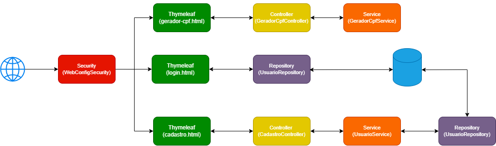

[JAVA__BADGE]:https://img.shields.io/badge/java-%23ED8B00.svg?style=for-the-badge&logo=openjdk&logoColor=white
[Postgre__BADGE]:https://img.shields.io/badge/postgres-%23316192.svg?style=for-the-badge&logo=postgresql&logoColor=white
[Spring__BADGE]:https://img.shields.io/badge/spring-%236DB33F.svg?style=for-the-badge&logo=spring&logoColor=white

# Gerador de CPF 💻

![Java][JAVA__BADGE]
![Spring][Spring__BADGE]
![Postgre][Postgre__BADGE]

Este sistema permite a geração e validação de números de CPF de diversas formas. Ele oferece quatro funcionalidades principais:

1. **Geração aleatória:** o usuário pode gerar um CPF completamente aleatório.
2. **Geração por estado:** o usuário pode escolher o estado de origem, e o sistema gerará um CPF correspondente.
3. **Geração personalizada:** o usuário informa os nove primeiros dígitos, e o sistema calcula os dois dígitos verificadores.
4. **Validação de CPF:** o usuário digita os onze dígitos de um CPF, e o sistema verifica se ele é válido. Caso não seja, o sistema corrige e retorna um CPF válido com os dígitos verificadores ajustados.

Este sistema foi desenvolvido com Java e Spring. A validação do usuário e a exibição de alguns trechos do código foram implementadas utilizando Spring Security, e o banco de dados utilizado é o PostgreSQL.

# 🏗 Arquitetura do Sistema



## 🔄 Descrição dos Fluxos

O diagrama de arquitetura apresenta três fluxos principais do sistema:

### 1️⃣ Fluxo de Geração e Validação de CPF

1. O usuário interage com a interface **Thymeleaf** para gerar ou validar um CPF.
2. A requisição é enviada para o **GeradorCpfController**.
3. O controller delega a lógica de negócio para o **GeradorCpfService**.
4. O serviço realiza o cálculo ou validação do CPF.
5. O resultado é retornado ao controller.
6. O controller envia a resposta de volta para a **view (Thymeleaf)** para exibição ao usuário.

---

### 2️⃣ Fluxo de Autenticação (Login)

1. O usuário acessa a página **login.html** e informa suas credenciais.
2. A requisição é interceptada pelo **Spring Security** configurado em `WebConfigSecurity`.
3. O Spring Security utiliza o **UserDetailsService** para carregar os dados do usuário.
4. O usuário é buscado no **UsuarioRepository**, que consulta o **banco de dados**.
5. O Spring Security valida a senha utilizando o **PasswordEncoder (BCrypt)**.
6. Se a autenticação for bem-sucedida, o usuário é redirecionado para a página inicial; caso contrário, retorna para a tela de login com erro.

---

### 3️⃣ Fluxo de Cadastro de Usuário

1. O usuário preenche o formulário de cadastro na interface **Thymeleaf**.
2. A requisição é enviada para o **CadastroController**.
3. O controller chama o **UsuarioService** para processar os dados.
4. O serviço aplica as regras de negócio e envia os dados para o **UsuarioRepository**.
5. O repository salva o usuário no **banco de dados**.
6. Após o cadastro, o sistema redireciona o usuário para a página de login ou exibe uma mensagem de sucesso.

# 💻 Tecnologias

- Java
- Spring
- PostgreSQL

# 🚀  Como Começar

## Clone o Repositório

```bash
git clone https://github.com/daniel-sd03/gerador-cpf.git
```
## Configuração

### Application.properties

O arquivo de configuração `application.properties` deve ser configurado com as informações do banco PostgreSQL. Para isso, você deve preencher o arquivo `application.properties` na pasta `src/main/resources` com as seguintes informações:

```properties
# Exemplo de configuração do banco de dados PostgreSQL
spring.datasource.url=jdbc:postgresql://<HOST>:<PORT>/<NOME_DO_BANCO>
spring.datasource.username=<SEU_USUARIO>
spring.datasource.password=<SUA_SENHA>

# Configuração do JPA/Hibernate
spring.jpa.hibernate.ddl-auto=update
spring.jpa.database-platform=org.hibernate.dialect.PostgreSQLDialect

```
# ⚠️ Aviso

  Este projeto foi desenvolvido exclusivamente para fins educativos e de aprendizado. O uso do código para fins ilegais ou prejudiciais não é de responsabilidade do autor. O usuário é responsável pelo uso do sistema e deve garantir que ele esteja em conformidade com as leis e regulamentos locais.

## 🤝 Colaboradores

| [Daniel Sodré](https://github.com/daniel-sd03) |
| :--------------------------------------------: |
